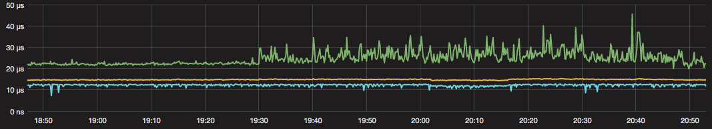

This script measures the latency of a network between two NICs.
It tries to take one high-precision timestamp every millisecond using hardware timestamping on Intel NICs.
Results are saved as histograms and metrics like the maximum and 99th percentile can be exported to a graphite server.
This can be used to monitor the latency of your network and detect congestion.


Usage
=====
1. Install and compile [libmoon](https://github.com/libmoon/libmoon), follow instructions there
2. Bind desired NICs to DPDK (see instructions in [libmoon](https://github.com/libmoon/libmoon))
3. Run it
```/path/to/libmoon latency-monitoring.lua --gateway <gateway IP> --src <src IP> --dst <dst IP> --graphite <graphite-server:line protocol port> --out-dir /path/for/histograms <tx port> <rx port>```
4. Use ```--help``` to see further options

Example
=======
This graph shows the mininum, median, and maximum latency from a test server through our core switches and core router. You can clearly see a bursty flow that starts at 19:30 and causes a long-tail latency behavior.


Hardware requirements and constraints
=====================================
This script currently requires a NIC that does hardware timestamping with flex filter support in DPDK, this limits it to Intel 10 and 40 Gbit/s NICs.
It would be possible to port it to Intel 1 Gbit/s NICs by implementing a flex filter driver for the newer ones or by not relying on hardware filters.

It currently only runs with to different physical ports, this could be fixed but was not required for our setup. (Pull requests welcome)


Constraint: libmoon defaults to a single timestamped packet in flight, this means you'll get a lower sample rate if your latency exceeds 1 ms.
This could be fixed, but the fix would be annoying. You probably want to fix your network if you see worst-case latencies > 1 ms.
